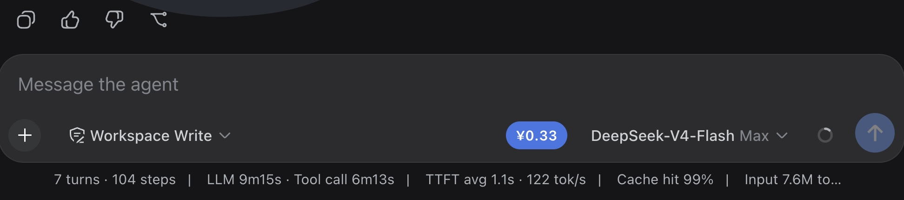

# dsh-cost-log

English | [简体中文](./README.md)

DSH native plugin: real-time current conversation cost based on DeepSeek pricing, displayed as a badge beside the input box (right side of the composer tool row, to the left of the model selector). Cost is computed by a durable Host session projection `costLog`, so paging, compaction, or history backfill never change the accumulated value. The browser only reads and renders the projection — no external requests.

<p align="center">
  
</p>

## Why dsh-cost-log?

**It is more than tokens multiplied by one static rate: it is a cost projection designed around official DeepSeek models and DSH session semantics. Version 1.0.0 is the stable release; future maintenance is limited to DeepSeek pricing changes and DSH compatibility.**

| Advantage | What it means |
| --- | --- |
| Durable conversation totals | Cost is computed in a Host-side durable session projection, not in the browser tab. Paging, context compaction, and history backfill do not change the accumulated value. |
| DeepSeek-specific pricing | Cache hits, cache misses, cache writes, and output are priced separately, with automatic selection by Flash / Pro, Beijing peak hours, CNY / USD, and legacy / new price tables. |
| No double counting or guessed rates | Usage for the same `turn/step` is de-duplicated by projection replacement rules. Unknown third-party models are marked as partially priced instead of receiving a potentially wrong fallback rate. |
| Privacy-first, zero extra deployment | No API key access, account-balance lookup, external request, database, proxy, or additional daemon is required. |
| Cost stays in the workflow | The badge remains beside the composer so the conversation total is visible before and after sending. Details open on demand and follow the DSH locale and light / dark theme. |

## Features

- Always-visible cost badge next to the input box; updates as token usage changes. Currency is configurable in DSH Settings > Plugins > **Plugin configuration** (CNY / USD, default CNY) and stored in the current browser.
- Tooltip language follows the DSH system language (Chinese / English).
- Hovering over the cost icon shows only: input tokens, output tokens, flash cost, pro cost.
- All displayed costs are rounded to 2 decimal places; amounts below 0.01 are shown as `<0.01`.
- CNY pricing since 2026-08-17:
  - `deepseek-v4-flash`: off-peak 0.05 / 1.5 / 4.5, peak 0.10 / 3.0 / 9.0 (CNY per million tokens)
  - `deepseek-v4-pro`: off-peak 0.15 / 4.5 / 13.5, peak 0.30 / 9.0 / 27.0 (CNY per million tokens)
- Official DeepSeek USD pricing:
  - `deepseek-v4-flash`: off-peak $0.007 / $0.22 / $0.66, peak $0.014 / $0.44 / $1.32 (USD per million tokens)
  - `deepseek-v4-pro`: off-peak $0.022 / $0.66 / $1.98, peak $0.044 / $1.32 / $3.96 (USD per million tokens)
- Peak hours use Beijing time: `9:00-12:00`, `14:00-18:00`; all other hours are off-peak, at half the peak rate.
- Before the effective time, legacy pricing (both CNY and USD) is used automatically.
- Pricing is limited to DSH's built-in `deepseek-official` provider with the exact model IDs `deepseek-v4-flash` and `deepseek-v4-pro`, displayed as `DeepSeek-V4-Flash` and `DeepSeek-V4-Pro`.
- Unrecognized third-party models are never guessed: the badge shows `≈` / `¥0+` (or `≈` / `$0+`).
- Styles use DSH WebUI design tokens (`--dsw-alias-*`) and follow light / dark themes.

Pricing sources: [official DeepSeek CNY pricing](https://api-docs.deepseek.com/zh-cn/quick_start/pricing) and [official DeepSeek USD pricing](https://api-docs.deepseek.com/quick_start/pricing), last verified 2026-08-15.

## Pricing basis

| Usage | Billing |
| --- | --- |
| Input (cache miss) | `inputTokens`, billed as 1M input tokens (cache miss) |
| Input (cache hit) | `cacheReadTokens`, billed as 1M input tokens (cache hit) |
| Cache write | `cacheWriteTokens`; DeepSeek does not quote this separately, billed as cache miss |
| Output | `outputTokens`, billed as 1M output tokens |

> The amount is a reference estimate based on provider-reported token usage, not an official DeepSeek bill. Usage chunks and `assistant/message` for the same `turn/step` are de-duplicated by the projection replacement rules.

### Pre-effective pricing

Before the new pricing takes effect, the current official rates are used:

```js
// lib/index.js
const LEGACY_RATES = {
  flash: { inputHit: 0.02, inputMiss: 1, output: 2 },
  pro:   { inputHit: 0.025, inputMiss: 3, output: 6 },
}

const LEGACY_RATES_USD = {
  flash: { inputHit: 0.0028, inputMiss: 0.14, output: 0.28 },
  pro:   { inputHit: 0.003625, inputMiss: 0.435, output: 0.87 },
}
```

## Architecture

```
Browser (Client)                               DSH Host
┌────────────────────────────┐   session   ┌──────────────────────────────┐
│ conversation.input.right    │  projection │ sessionProjections registry  │
│ cost badge beside input     │ ◄────────── │ costLog projection            │
│ useProjection('costLog')    │  durable    │  ├ request/header model       │
│ React + hand-written bundle │             │  ├ assistant/chunk usage     │
│ locale + localStorage       │             │  └ assistant/message usage   │
└────────────────────────────┘             │ cost by time x model x tier │
                                            │ outputs both CNY / USD       │
                                            └──────────────────────────────┘
```

- **Host** ([`lib/index.js`](lib/index.js)): registers the `sessionProjections` key `costLog` and outputs both CNY and USD cost.
- **Client** ([`lib/client.js`](lib/client.js)): hand-written CJS bundle (`window.__ModuleLoader__.load`), registered in the `conversation.input.right` slot, reads `useProjection('costLog')`, localizes tooltips via the `locale` service, and stores the selected currency in browser local storage.
- No external HTTP calls, no cookies, no database, no local server, no build step.

## Installation

From npm:

```bash
dsh plugin --profile web add dsh-cost-log
```

From GitHub:

```bash
dsh plugin --profile web add github:kami-mura/dsh-cost
```

Return to the terminal running DSH, press `Ctrl+C` to stop the old process, then start it again:

```bash
dsh web
```

Uninstall:

```bash
dsh plugin --profile web remove dsh-cost-log
```

> Requires DSH runtime capabilities: Host `sessionProjections`; Client `slots`, `locale`, the `react` platform module, and the `conversation.input.right` slot provided by `ui-conversation`.

## Quick start

1. Install the plugin and restart DSH Web.
2. Open any conversation.
3. The cost badge appears on the right side of the input box; hover to see token usage, click to view the flash / pro cost breakdown.

To switch currency, open DSH Settings > Plugins > **Plugin configuration** and choose CNY or USD.

## Files

| File | Description |
| --- | --- |
| `lib/index.js` | Host half (`costLog` session projection + peak/off-peak pricing + settings namespace) |
| `lib/client.js` | Client bundle (cost badge + Plugin configuration currency card) |
| `cordis.patch.yml` | Bundle patch (mounts the Host half in the profile layer stack) |
| `package.json` | Package manifest (`dsh.bundle.patch` + `dsh.client.platform: "web"`) |
| `tests/pricing.test.mjs` | Pricing, model validation, boundary, and projection folding tests |
| `tests/client.test.mjs` | DSH client module registration regression test |

Run tests:

```bash
node --test tests/*.test.mjs
```

## Contributing

Version 1.0.0 is in stable maintenance. New features are out of scope; updates are limited to official DeepSeek pricing changes and DSH compatibility. Keep the English and Chinese README files in sync for user-visible changes.

## License

[MIT](LICENSE)
